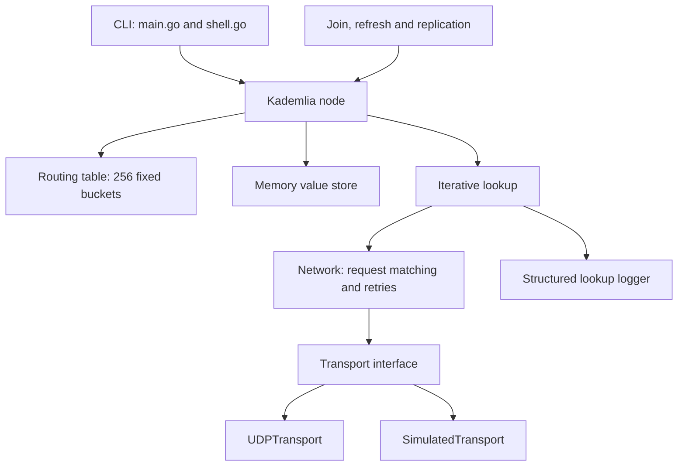

# Part 1: Kademlia implementation and experimental evaluation

Date: 29 September 2026  
Group number: **TO BE PROVIDED**  
Group members: **TO BE PROVIDED**  
Repository: [SebPet-00/D7024e-labs](https://github.com/SebPet-00/D7024e-labs)  
Scope: The Part 1 implementation and evaluation below describe the implementation through step 11.
The Part 2 architecture, cryptography, ownership verification, validation, thread safety,
limitations and demonstration are documented in [PART2.md](PART2.md).

## 1. Purpose and requirements

The system is a content-addressed distributed store. A value's key is SHA-256
of its exact bytes, and receivers validate this relationship when storing and
retrieving data. Node IDs are SHA-256 of the canonical IP:port address. The key
space is 256 bits, K defaults to 10, and Alpha defaults to 3. Both parameters
are configurable.

The implementation supports joining, iterative node/value lookup, storage,
periodic replication, routing maintenance, a command shell, UDP deployment and
an in-process simulator. There is deliberately no value expiration. Disk
persistence, lookup-path caching, generalized bucket splitting, TCP value
transfers are outside the Part 1 implementation. Part 2 registry support is described separately in [PART2.md](PART2.md).
These choices and the minimum requirements are based on the local
[lab specification](Instructions/LAB-SPEC.md).

## 2. Architecture and implementation



| Component | Responsibility |
|---|---|
| main.go / shell.go | Bind a node, optionally join a bootstrap, handle signals, and implement ping/put/get/show/exit. |
| kademliaid.go / contact.go | SHA-256-sized IDs, XOR distance, safe parsing, validated contact identity and owned copies. |
| bucket.go / routingtable.go | Fixed b=1 buckets, bounded K contacts, recency and nearest-contact selection across all buckets. |
| routing_maintenance.go / maintenance.go | Version-checked eviction, full join, stale-bucket refresh and background maintenance. |
| network.go | Random request IDs, pending RPC matching, timeouts, retransmissions and dispatch. |
| transport.go / udp_transport.go / simulated_network.go | Shared packet API; real UDP or controlled in-process delivery. |
| lookup.go / lookup_data.go | Shared iterative shortlist loop; local-first value retrieval and early termination on verified data. |
| datastore.go / store.go / store_rpc.go / find_value.go | Owned memory values, verified STORE acknowledgments and FIND_VALUE responses. |
| replication.go | Periodically publish every local value to current closest nodes without deleting existing copies. |
| lookup_events.go | Serialized JSONL events and per-lookup probe/attempt/round counters. |
| experiments/runner.go | Seeded topologies, actual joins, workloads and independent correctness checks. |
| scripts/analyze_experiments.py | Validate raw event counts, aggregate results and draw figures. |

Lookup proceeds in strict parallel batches of at most Alpha probes. Candidates
are ordered by XOR distance; failed candidates are excluded and farther known
contacts remain available as replacements. Node lookup stops when the current
K closest surviving candidates have all responded. A value lookup stops at the
first verified value and cancels/drains outstanding requests. It does not cache
the downloaded value. A node lookup returning nil error is an API-level outcome,
not independent proof that it found the globally closest nodes.

STORE first performs node lookup, includes the publisher among the candidates,
and selects up to K closest targets. It acknowledges success only when every
selected target has acknowledged; a small network can have fewer than K targets.
A partial failure returns the key and an error without rolling back successful
writes. Replication reuses this path and retains old copies, even if their holder
is no longer among the closest nodes. Newly observed responsible peers receive relevant copies through a bounded
background STORE worker. The closest known existing holder sends each copy;
periodic replication repairs failed transfers and incomplete routing knowledge.
Transfers are asynchronous and retain existing copies.

Joining pings a bootstrap, looks up the joining node's ID, and refreshes the
farther bucket ranges, including empty ranges. Full buckets retain responsive
old contacts. Observation versions prevent an old timeout from removing a peer
that has communicated more recently.

## 3. Protocol, limits and thread safety

RPCs are JSON over UDP. Each logical request has a cryptographically random
128-bit request ID, reused for retransmission. Responses must match the pending
request ID, method, observed source address and address-derived node ID.
This provides resistance to off-path response guessing; it is not authentication
against an attacker who can observe or intercept traffic.

Production defaults are a two-second timeout per attempt and two retries
(three attempts total). RPCs retry timeouts, not explicit rejections or local
send errors. After all attempts time out, routing removal is guarded by the
contact's observation version. Caller deadlines and node closure cancel work.
The interactive command deadline defaults to 30 seconds; refresh and replication
default to one hour.

Values are limited to 1,024 bytes by default, configurable from 255 to 32,768
bytes. The upper bound leaves room for base64 and the JSON envelope within the
65,507-byte UDP payload limit. IP fragmentation can still occur on real networks;
the simulator models a datagram as a single delivery/loss unit.

Thread safety uses ordinary mutexes for routing tables, stored values, pending
RPC state, simulator delivery state/RNG and log writes. IDs, contacts and byte
slices are copied at ownership boundaries. Replication snapshots data under a
read lock, releases that lock, and only then makes network calls. Eviction
probes also release routing locks before PING. Join, refresh and replication
passes share a cancellation-aware maintenance gate.

Lookup candidates belong to the lookup goroutine; worker replies arrive through
a buffered channel and are drained before return. Logging counters use atomic
increments because probes run concurrently. A separate logger mutex keeps JSON
records intact; the logger does not hold routing/storage locks. Shutdown signals
workers, closes the transport and waits for node background workers. Race tests
exercise these paths; passing them is evidence for the tested schedules, not a
proof for every possible execution.

Only Go's standard library is used in the application, including crypto,
JSON, networking, synchronization and command parsing. No RPC library is used.
The deployment helper and statistics calculations use Python's standard library.
Matplotlib generates the figures; its exact environment is recorded in
scripts/requirements-analysis.txt. Docker/Compose provide containerization.

## 4. Instrumentation and experimental method

Every measured lookup emits lookup_start, probe and lookup_end JSONL records.
They include lookup ID, initiating node, target key and lookup type. Probe
records additionally identify the peer, RPC request ID and attempt number.
The final record includes API success/failure, error, logical probes,
transmission attempts, parallel rounds and elapsed time.

A **logical probe** is one FIND_NODE or FIND_VALUE peer RPC. A **transmission
attempt** includes the first send and any retries; therefore one probe can have
one, two or three attempts. A local send error still counts as an attempted
transmission. Replies, STORE and eviction PINGs are excluded. Local hits emit a
successful end with zero probes. The external analyzer reconstructs counts
from individual probe records and rejects missing or inconsistent outcomes.

The runner then records an independent trial_result. Node-lookup correctness
requires the exact ordered K closest other nodes, calculated from all node IDs.
Value-lookup correctness requires the exact original bytes. Thus the plots do
not conflate an API returning without error with a correct answer.

### Controlled conditions

- Five topology/workload seeds: 11, 22, 33, 44 and 55.
- Simulator loss RNG seed: workload seed + 100000.
- Twenty sequential foreground lookups per seed and condition.
- Scale experiment: N = 25, 100, 250, 500 and 1000; zero configured loss.
- Reliability experiment: N = 100; packet loss = 0, 0.1, 0.3, 0.5, 0.7 and 0.9.
- K = 10; Alpha = 3; two retries; 100 ms per RPC attempt; two-second lookup deadline.
- Zero added simulated latency; delivery still depends on goroutine scheduling.
- Random unique IPv4:port addresses; IDs derived from those addresses.
- Random 64-byte values; keys are SHA-256 of those values.
- Sequential full joins to a bootstrap, with no manually seeded complete tables.
- Loss-free setup. Reliability values are distributed through the actual STORE
  path before loss is enabled. Readers are selected from nodes that do not
  already hold the requested value.
- No churn. Refresh/replication periods are set to 24 hours so scheduled passes
  do not enter these short measurements. Ordinary routing updates and eviction
  PINGs still operate; contacts can be removed after loss-induced timeouts.
- Each seed/condition starts with a fresh network. The twenty queries within
  a run share routing history, which can learn or degrade during that run.

The 100 ms experimental RPC timeout differs from the production two-second
default to make the loss sweep practical with zero simulated latency. Results
therefore characterize the stated experimental policy, including the two-second
overall deadline, rather than arbitrary WAN behavior.

Seeds reproduce address generation, values, query sources and the loss RNG
stream. They do not make goroutine scheduling, timer delivery, random RPC tokens
or routing evolution bit-for-bit deterministic. The simulator assigns loss
draws in send order, so concurrent sends can receive different draws on a rerun.
Multiple seeds and reported dispersion make this limitation visible rather
than hiding it.

For each condition, the analyzer first averages each seed's twenty samples,
then reports the mean and sample variance of the five seed-level averages.
Variance uses denominator 4. Figure error bars are one standard deviation across
seed means, not confidence intervals and not the spread of individual lookups.
Probe means include failed lookups as well as successful ones. Raw events,
per-lookup data, per-seed summaries and aggregate tables are all retained.

### Expected behavior

XOR routing should improve the matching prefix over successive discoveries,
so lookup growth is expected to be logarithmic in network size under adequate
routing-table coverage. The original paper's proof sketch makes that coverage
assumption explicit. Our strict Alpha batching and final verification of K
candidates add constant work; total probes are not the same as sequential hops.
The plotted log2(N) line is anchored at the first measured mean as a visual
comparison, not a fitted law or a claimed exact bound.
[Maymounkov and Mazieres, Kademlia, sections 2–3](https://www.scs.stanford.edu/~dm/home/papers/kpos.pdf).

If request and reply datagrams are independently lost with probability p,
a single exchange succeeds with probability (1-p)^2. Ignoring delays and
correlations, three attempts succeed with probability
1 - (1 - (1-p)^2)^3. This is a per-RPC calculation, not a prediction for a whole
lookup: replicas, parallel probes, discovered alternatives, false eviction and
the total deadline all affect DHT success. Increasing loss should generally
reduce successful retrieval and increase attempts per logical probe. Total work
need not increase monotonically when lookups exhaust candidates or hit deadlines.

## 5. Results

These recorded results predate the joining-time transfer change. The experiment
matrix has not been rerun for that change; regenerate the data before claiming
these measurements describe the updated implementation.

All 55 seed/condition runs completed, producing 1,100 measured lookups.
The external analyzer validated 500 node lookups and 600 value lookups against
their raw probe records. Every condition contains five runs and 100 queries.

### 5.1 Node lookup probes versus N


| N | Correct results | Mean logical probes | Variance of seed probe means | Mean rounds | Variance of seed round means |
|---:|---:|---:|---:|---:|---:|
| 25 | 100/100 | 10.000 | 0.000000 | 4.000 | 0.000000 |
| 100 | 100/100 | 11.050 | 0.067500 | 4.240 | 0.009250 |
| 250 | 100/100 | 12.030 | 0.080750 | 4.500 | 0.031250 |
| 500 | 100/100 | 12.400 | 0.083750 | 4.640 | 0.003000 |
| 1000 | 100/100 | 13.680 | 0.157000 | 5.000 | 0.017500 |

Every result matched the exact global nearest-node oracle, and no retries
occurred in these loss-free measurements. Increasing N by a factor of 40 raised
mean probes by 36.8%, from 10 to 13.68, while rounds rose from four to five.
At N=25 the measured work is entirely the ten probes needed to verify the final
K candidates; strict Alpha=3 batching requires four rounds for those ten probes.
Larger networks add discovery work rather than multiplying that baseline.

The observed slow growth is compatible with logarithmic routing over this range,
but is not an asymptotic proof. The anchored log2(N) reference rises faster than
our measured curve: it does not separately represent the constant K-candidate
verification cost. Good initial routing coverage from full joins also reduces
discovery work. Five network sizes up to 1,000 nodes cannot distinguish all
possible growth laws or establish behavior at substantially larger scales.

### 5.2 Value lookup reliability versus loss


| Loss probability | Correct results | Mean success fraction | Variance of seed success fractions | Mean logical probes | Mean attempts including retries | Variance of seed attempt means |
|---:|---:|---:|---:|---:|---:|---:|
| 0.00 | 100/100 | 1.000 | 0.000000 | 2.890 | 2.890 | 0.059250 |
| 0.10 | 100/100 | 1.000 | 0.000000 | 3.100 | 3.340 | 0.153000 |
| 0.30 | 100/100 | 1.000 | 0.000000 | 3.590 | 4.820 | 0.533250 |
| 0.50 | 100/100 | 1.000 | 0.000000 | 4.140 | 7.590 | 1.406750 |
| 0.70 | 85/100 | 0.850 | 0.001250 | 8.690 | 21.840 | 1.448000 |
| 0.90 | 14/100 | 0.140 | 0.001750 | 19.040 | 53.650 | 6.538750 |

No retrieval failures were observed through 50% loss in this finite workload.
That is not a guarantee of perfect reliability at those probabilities. At 70%
loss, mean success was 85% with a seed-level standard deviation of about 3.54
percentage points. At 90%, success was 14% with a standard deviation of about
4.18 percentage points.

All 15 failures at 70% loss and all 86 failures at 90% loss ended with
context deadline exceeded. They did not establish that the value was absent.
The figure measures correct retrieval within the stated two-second deadline.
At extreme loss, retransmissions and additional rounds consume that budget.

At 50% loss, the simple per-RPC three-attempt success calculation is about
57.8%, yet all 100 DHT retrievals succeeded. These quantities differ: lookup
can contact several holders and discover alternatives, and needs only one
verified value. At 90% loss that per-RPC probability is only about 3.0%, so
even parallel probes and replicas struggle within the deadline. Mean attempts
rose from 2.89 without loss to 53.65 at 90% loss; this separates retransmission
overhead from the 19.04 logical probes at that condition.

The data support the expected direction of the loss effect, while also showing
why retry policy and the global deadline must accompany any success-rate claim.
They do not measure joins under loss, correlated loss, churn, or production WAN
latency. Complete probe/attempt/round variance tables and seed-level summaries
are available in [the analysis directory](results/analysis).


## 6. Verification and deployment

The final complete suite passed with the Go race detector enabled:
`CGO_ENABLED=1 go test -race -count=1 -timeout=180s -coverprofile=results/coverage.out ./...`.
Total statement coverage was **92.1%**, above the required 80%; no work was added
solely to raise coverage beyond that threshold. The CLI package measured 85.2%,
the Kademlia package 95.2%, and the experiment workload package 86.0%.
The thin command wrapper in cmd/experiments is exercised by the actual runs,
but has no unit-test coverage. `go vet ./...` and the two Python analysis tests
also passed. Coverage measures executed statements, not correctness by itself.


The existing 1,000-node tests instantiate actual nodes with RPC receivers.
One exercises simultaneous ring PINGs; another checks node lookup against a
global nearest-node oracle using bounded, directly seeded routing tables.
The experiment runner supplements these with 1,000-node networks built by full
joins. Its small regression test checks loss-free node/value success, complete
packet-loss failure, output records and refusal to overwrite existing runs.
Logging tests cover retries, concurrent lookups, local hits, malformed input,
and writer failures. Python tests validate event-count reconstruction and
variance across seed means.

Step 10 verified 50 separately running Docker containers and an inter-container
store/retrieve smoke test after the publisher exited. On this Docker Desktop/WSL
installation, separate bridge endpoints repeatedly timed out above roughly
30 containers. The verified configuration shares the bootstrap's network
namespace and gives peers separate UDP ports. Containers remain separate
processes/filesystems, but this does not test network isolation or multi-host
deployment. This step retains that configuration; it does not claim a new
50-container rerun. See RUNNING.md for commands and the limitation.

## 7. Limitations and next work

The observations concern small-to-medium simulated networks, five seeds and
a finite workload. They do not prove asymptotic behavior, production reliability,
security against active attackers, or recovery under churn. All joins use one
bootstrap and setup is loss-free; failure to join under loss is not measured.
Reader selection excludes holders and advances through node order when an
initial choice is a holder, so it is not exactly uniform over non-holders.

The simulator omits bandwidth limits, variable latency, IP fragmentation and
correlated/bursty loss. It has bounded receive queues, so configured packet
loss is not the only possible cause of a dropped datagram. Logging is synchronous
and can affect scheduling; elapsed_ns includes logging overhead and is not used
as a latency result. Events count outbound lookup requests, not every message
or byte sent by the DHT.

There is no persistence, expiration or bound on the number of stored keys.
Replication cannot recover data after every holder leaves, and its simple
all-values snapshot consumes memory proportional to stored data. The fixed
bucket layout and scanning/sorting approach favor clarity over optimization.
RPCs do not authenticate on-path peers, and the system is intended for the lab's
controlled network. JSON contact lists also grow with K and can exceed UDP
limits for impractically large settings.

Useful future work is controlled churn evaluation, correlated loss, configurable
latency distributions, deterministic simulation scheduling and more efficient
replication. None of these is presented as implemented or measured here. Part 2 remains separate.

## 8. Reproducing the results

The run used Go 1.25.4 on Linux/amd64 in WSL, with no race instrumentation during
measurements. The base repository commit was
02920320cafd373f3648f6f5a687cad35bfee00e; step 11 additions were in the working tree.

```sh
go run ./cmd/experiments -out results/repeat
python3 -m venv .venv-analysis
.venv-analysis/bin/pip install -r scripts/requirements-analysis.txt
.venv-analysis/bin/python scripts/analyze_experiments.py results/repeat --out results/repeat-analysis
CGO_ENABLED=1 go test -race -count=1 -timeout=180s -coverprofile=coverage.out ./...
go tool cover -func=coverage.out
go vet ./...
PYTHONDONTWRITEBYTECODE=1 python3 -m unittest discover -s scripts -p 'test_*.py'
```

Raw files are created exclusively: choose a fresh output directory for another
run. Interrupted/incomplete runs are rejected by analysis. Files in
results/part1 contain the measured evidence; results/analysis contains the
derived tables and figures. Group number and names must be supplied on the
cover before this document is submitted.
